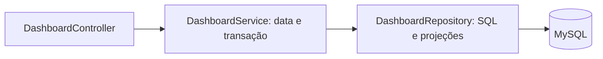

# Etapa 10 — Incremento 6: persistência do dashboard

Resolve P05: DashboardService misturava definição da data/snapshot, consultas SQL e mapeamento das linhas. A tag v0.1-baseline-backend não foi alterada; P04 e P06 ainda estão pendentes.

## Antes → problema → depois

O service continha oito consultas e seus row mappers, além da coordenação da operação. Alterações de persistência e de coordenação incidiam sobre o mesmo componente.

Agora DashboardRepository concentra SQL e projeções de relatório. DashboardService recebe o repository e Clock, define a data da biblioteca e coordena a transação REPEATABLE_READ/readOnly. Ele passa data e limite ao repository. Nenhuma interface foi criada sem necessidade de substituição real.

A consulta do repository exige uma transação existente por Propagation.MANDATORY. Não inicia transações separadas por indicador, e não define fuso ou lê o relógio. O limite e os filtros continuam parametrizados. A classificação dos empréstimos recentes continua usando LoanStatus.

A separação aplica SRP e maior coesão de responsabilidade, sem transformar o relatório em microserviço ou trocar JDBC por JPA sem motivo. Retornar DTO de relatório é uma escolha pragmática neste monólito; não afirmamos isolamento absoluto entre persistência e contratos de saída.

## Validação

`python3 /workspace/library-runtime/run.py test package`: **56 testes**, zero falhas, erros ou ignorados; build e empacotamento passaram. Os 54 testes anteriores continuam, incluindo ranking sem multiplicação por autores, limites de atraso, filtros, contagens e circulação concorrente.

Dois testes adicionais verificam:

- na entrada do repository via service, há transação ativa, readOnly=true e isolamento REPEATABLE_READ;
- chamada ao repository sem transação falha antes das consultas.

A instrumentação do spy precisou acessar o alvo do proxy Spring para configurar o teste sem disparar Propagation.MANDATORY antes da chamada real. A exigência transacional permaneceu intacta; não desabilitamos o advisor para fazer o teste passar.

Comparação das oito strings SQL reconstruídas após concatenação confirmou conteúdo e ordem preservados. Não alteramos queries, DTOs, migrations ou política de classificação neste incremento. API reiniciada respondeu dashboard por HTTP, mantendo estrutura e validação de limite.

A verificação de isolamento não é um experimento de todas as interleavings de escrita concorrente em relatório. Ela complementa a arquitetura existente e os testes de resultados. Nenhuma redução de consultas ou ganho de latência é alegada: o objetivo aqui é responsabilidade e manutenção.

## O que entender e defender

O service define a operação e a consistência exigida; o repository executa persistência dentro desse contexto. Distribuir cada consulta em uma transação própria poderia tornar os indicadores incompatíveis. Separar classes ajuda apenas quando essa fronteira de responsabilidade permanece clara.

Em Análise e Projeto: SRP, coesão, ocultamento dos detalhes SQL e dependências explícitas. Em Banco de Dados: preservação do snapshot, isolamento e consultas de agregação. A quantidade de classes aumenta de modo justificado; isso não prova redução automática de complexidade.

Próximo incremento: centralizar o contrato de paginação repetido nos endpoints (P04), mantendo defaults, limites e mensagens públicas.
