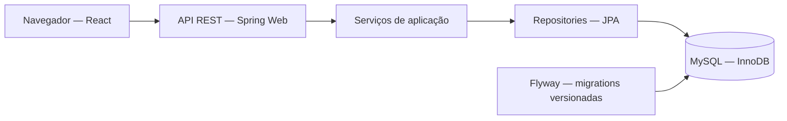
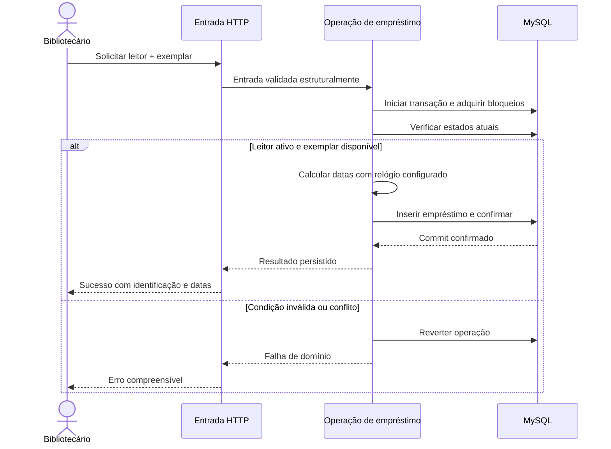

# Etapa 6 — Arquitetura e decisões de projeto

Arquitetura proposta para o [MVP](../requirements/mvp-scope.md), com base nos [casos de uso](../requirements/use-cases.md) e no [modelo do banco](../database/initial-model.md). Os diagramas descrevem o projeto planejado; ainda não existem classes, endpoints ou processos executáveis. Decisões serão revisadas com evidência da implementação.

## ADR01 — Monólito organizado por domínio

**Decisão:** um backend Spring Boot, um banco MySQL e um frontend React. Organização do backend por domínio, com camadas internas; não haverá serviços distribuídos.

**Motivo:** circulação depende de catálogo e leitores na mesma transação. Uma equipe individual e volume acadêmico não justificam comunicação distribuída, filas e consistência eventual. Organização por domínio aproxima arquivos que mudam pelo mesmo motivo.

**Alternativas:** pacotes globais controller/service/repository são simples, mas dispersam uma funcionalidade; microsserviços dão isolamento de implantação, porém exigem operação e consistência mais complexas. Ambos seriam possíveis em outros contextos.

**Custo:** deployment único, fronteiras reforçadas por disciplina e revisão, não por isolamento de processos. Chamamos os grupos de módulos lógicos; não alegamos isolamento estrito enquanto não houver contratos e verificação de dependências.

## ADR02 — Camadas com responsabilidades pequenas

| Elemento | Responsabilidade | Exemplo proposto |
| --- | --- | --- |
| Controller | Receber HTTP, validar estrutura da entrada, chamar caso de uso e traduzir resultado | LoanController |
| DTO | Definir entrada/saída sem expor entidades JPA | CreateLoanRequest, LoanResponse |
| Service | Coordenar operação, regras e transação | LoanService |
| Entidade | Representar estado persistido e invariantes locais quando útil | Loan |
| Repository | Consultar/persistir e oferecer leituras com bloqueio necessárias | LoanRepository |
| Política/configuração | Fornecer decisões configuráveis e relógio | Prazo inicial e Clock |
| Tratamento de erros | Traduzir falhas previstas em contrato HTTP | ApiExceptionHandler |

Regras locais podem ficar na entidade quando expressarem seu comportamento. Regras que exigem leitor, exemplar e banco ficam na operação de aplicação. Bean Validation protege formato; não prova que um leitor está ativo ou um exemplar disponível.

Não criar uma interface para cada service, mapper ou classe de validação. Injeção por construtor explicita dependências. Interfaces serão usadas quando representarem fronteira ou substituição real, como as interfaces de persistência providas por Spring Data. DTOs podem usar records e mapeamento manual enquanto isso continuar claro.

## ADR03 — Módulos e dependências

| Módulo lógico | Conteúdo | Dependências permitidas |
| --- | --- | --- |
| catalog | Author, Category, Book, BookCopy e manutenção de catálogo | Infraestrutura técnica |
| readers | Reader, manutenção de cadastro e status | Infraestrutura técnica |
| loans | Loan, empréstimo, devolução e histórico | Operações/consultas necessárias de catalog e readers |
| reporting | Consultas de dashboard e agregações | Dados de catalog, readers e loans; somente leitura |
| configuration | Configuração de relógio, CORS e execução | Sem dependência de regras de circulação |
| api | Contrato comum de erros | Sem orquestrar regras de negócio |

Pacote raiz proposto: `com.lucashenrique.library`. Dentro de cada domínio, classes são agrupadas por função quando a quantidade justificar subpacotes; não criar hierarquia vazia. Reporting só será separado quando as consultas existirem.

Um leitor pode consultar histórico pela API de empréstimos, sem fazer readers depender de loans. Como empréstimo é dono da operação, loans coordena a circulação. Manutenção do catálogo que precise verificar histórico, como mudança de ISBN, deve evitar criar dependência circular por services: usar consulta de persistência explicitamente documentada ou reposicionar a operação de aplicação que atravessa domínios. A solução concreta será escolhida na implementação; não adicionar barramento de eventos para ocultar esse problema.

Relacionamentos JPA entre entidades de domínios distintos podem gerar dependências de tipos. São aceitos neste monólito quando úteis, sem fingir que os módulos têm isolamento total. Se necessário, referências por id e consultas explícitas são alternativas; avaliar impacto na simplicidade e integridade.

## ADR04 — Transações na operação de aplicação

**Decisão:** empréstimo, devolução, mudança de status e alterações com múltiplas gravações devem ter limite transacional explícito no service. Repository isolado não constitui a transação completa do caso de uso.

- Criar/editar livro: livro e vínculos de autores confirmam juntos.
- Emprestar: revalidar leitor, livro e exemplar sob proteção concorrente, calcular datas e inserir Loan.
- Devolver: bloquear/revalidar empréstimo e registrar devolução uma única vez.
- Desativar leitor e retirar exemplar: participar da mesma coordenação de bloqueios usada pelo empréstimo.
- Alterar ISBN: coordenar com novos empréstimos antes de verificar ausência de histórico.

Manter a ordem global proposta leitor → livro → exemplar → empréstimo; dentro de um tipo, id crescente. Bloqueios pessimistas e UNIQUE condicional complementam-se. Todas as operações relevantes precisam seguir a coordenação; anotações isoladas não provam correção. Leituras atuais, isolamento e conflitos serão testados no MySQL.

Evitar chamadas externas dentro dessas transações. Relatórios são somente leitura, paginados/limitados conforme contrato. A configuração de leitura não implica snapshot consistente de várias consultas automaticamente; o nível de consistência do dashboard será declarado na implementação.

O service transacional precisa ser chamado pelo mecanismo Spring: autochamada de método não deve ser presumida como nova transação. Tratamento de erro não pode capturar falha e confirmar parcialmente uma operação. Deadlocks/timeouts exigem rollback e resposta clara; retries só serão adotados com diagnóstico e sem duplicar ações confirmadas.

Sequência conceitual da operação proposta, não trace de código executado. Perda de conexão durante commit pode deixar resultado incerto: não afirmar rollback sem confirmação, conforme UC05/UC06.

## ADR05 — Persistência e evolução de schema

Flyway é a única fonte de alterações do schema, em `backend/src/main/resources/db/migration`. Hibernate fará validação, sem `ddl-auto=update`. Não duplicar migrations em database/. Queries de relatório podem usar projeções ou SQL explícito quando houver benefício, mantendo parâmetros e testes.

Entidades não são serializadas diretamente na API. Relacionamentos carregados e JOINs devem ser selecionados para a consulta, evitando dependência de sessão aberta no controller. Proposta: desabilitar Open Session in View, materializar DTOs dentro do limite apropriado e investigar N+1 com consultas e evidência, não apenas trocar tudo para EAGER.

MySQL de testes será isolado dos dados de desenvolvimento. Testcontainers é candidato se o runtime oferecer Docker; alternativa é uma instância MySQL de testes configurada. Não substituir validação de constraints MySQL por H2 e alegar equivalência.

## ADR06 — Contratos HTTP e tratamento de erro

REST com recursos de catálogo, leitores, exemplares e empréstimos. URLs concretas e payloads serão consolidados antes da implementação de cada fluxo. Paginação terá limites e ordenação estável; API não entrega listas ilimitadas por padrão.

| Situação | Resposta proposta |
| --- | --- |
| Criação confirmada | 201 com identificação do recurso |
| Consulta/edição com representação | 200 |
| Exclusão permitida confirmada | 204 |
| Entrada estrutural ou formato inválido | 400 com erros de campos |
| Recurso inexistente | 404 |
| Estado incompatível, unicidade ou vínculo impeditivo | 409 |
| Falha interna inesperada | 500 com mensagem pública genérica |

Payload de erro terá código estável, mensagem, caminho e erros de campo quando cabíveis, sem SQL, credenciais ou stack trace. Nem toda DataIntegrityViolationException significa duplicidade: classificar apenas constraints conhecidas; falhas desconhecidas exigem diagnóstico nos logs. A interface apresenta sucesso só após confirmação e diferencia erro de lista vazia.

Datas de calendário serão strings ISO `YYYY-MM-DD`. O servidor define empréstimo e devolução com Clock e fuso configurados, não com datas arbitrárias enviadas pelo navegador.

## ADR07 — Segurança proporcional ao estágio

Primeira baseline: execução local isolada sem autenticação, validação server-side, queries parametrizadas, CORS limitado, credenciais por ambiente e erros sem detalhes internos. CORS não é autenticação e não impede requisições de clientes fora do navegador.

Antes de escrita pública: autenticação e autorização para bibliotecário, HTTPS e estratégia adequada de CSRF/cookies caso seja usada sessão. Não adotar JWT apenas por costume. Decidir mecanismo quando a topologia de publicação estiver definida; não apresentar a baseline local como pronta para exposição pública.

## ADR08 — Frontend separado e simples

React/TypeScript/Vite consumirá DTOs por HTTP. Organização por telas/features com componentes pequenos compartilhados para campos, botões e feedback. Acesso HTTP centralizado para base URL e erros, sem componente global que concentre regras de negócio.

Estado local para formulários; biblioteca de cache só se o gerenciamento de dados justificar. React Router quando houver navegação real. CSS com tokens atende tema dark e reduced motion inicialmente. Acessibilidade inclui foco, labels, teclado e associação de mensagens, não somente atributos ARIA.

## ADR09 — Baseline didática e arquitetura desejada

A arquitetura acima é o destino, não uma descrição da versão inicial já construída. A baseline terá os mesmos requisitos de integridade, segurança local e comportamento, mas poderá apresentar:

- serviços que misturam validação, mapeamento e orquestração de modo plausível;
- repetição pequena de consultas/validações em operações semelhantes;
- dependência direta de configuração de prazo, dificultando variação e teste;
- organização por camadas globais, dispersando uma funcionalidade.

Não colocar toda lógica no controller, criar um serviço gigante artificial ou inserir defeitos deliberados de concorrência. Selecionar um conjunto pequeno de problemas realmente observáveis; não prometer todos os exemplos acima antes de ver o código. Testes de comportamento e integridade acompanham o baseline; deficiência de cobertura será registrada se existir, não fabricada destruindo testes.

Preservar versão funcional em commit/tag após validação. Medir e registrar problemas antes de corrigir, comparar as mesmas funções e dados. Refatoração muda estrutura preservando comportamento; incluir funcionalidade nova durante a comparação exige separar os resultados.

## ADR10 — Padrões e princípios sem excesso

SRP orienta HTTP, persistência e operação separados; GRASP Controller descreve coordenação da entrada, e Information Expert orienta decisões com os dados necessários. Coesão e acoplamento serão avaliados nas dependências reais.

Spring Data usa abstrações de persistência e infraestrutura de proxies, mas isso não significa que implementamos manualmente todos esses padrões. Strategy para prazo só entra se políticas alternativas reais justificarem. Não usar Observer para garantir integridade transacional, Singleton com estado mutável global ou factories sem variação concreta. Interfaces e padrões têm custo de navegação e manutenção que deve ser defendido.

## Verificação futura da arquitetura

1. Build e contexto Spring iniciam com schema criado por Flyway e validado pelo Hibernate.
2. Testes de service verificam regras com relógio controlável.
3. Integração MySQL verifica constraints, rollback, empréstimos/devoluções concorrentes e mudanças de estado concorrentes.
4. Controller traduz falhas esperadas sem expor detalhes internos.
5. Fluxo completo pelo HTTP confirma cadastro, empréstimo, indisponibilidade, devolução e histórico.
6. Revisão verifica controllers pequenos, ausência de ciclo entre services e consultas que não dependam de sessão no controller.

Essas verificações ainda não foram executadas. Não há cobertura, desempenho ou métrica de acoplamento medida nesta etapa.

## O que entender e defender

A arquitetura escolhe onde vivem responsabilidades e como interagem; a normalização escolhe como fatos são organizados no banco. Uma não garante automaticamente a outra. O service define a operação atômica, enquanto o banco oferece constraints e bloqueios para sustentá-la.

Conceitos das disciplinas: camadas, ocultamento de informação, coesão, acoplamento, GRASP e refatoração em Análise e Projeto; transações, integridade e evolução do schema em Banco de Dados.

Perguntas para apresentação: por que monólito? Porque o fluxo cabe em uma aplicação e uma transação local. Por que DTO? Para separar contrato público da persistência. Por que não interface para tudo? Porque abstração precisa de uma variação ou fronteira justificável. Por que manter proteção na baseline? Porque refatoração acadêmica não exige comprometer dados ou segurança.

Próxima etapa: estrutura inicial de desenvolvimento e convenções do repositório, criando arquivos somente quando úteis e preparando a implementação progressiva.
