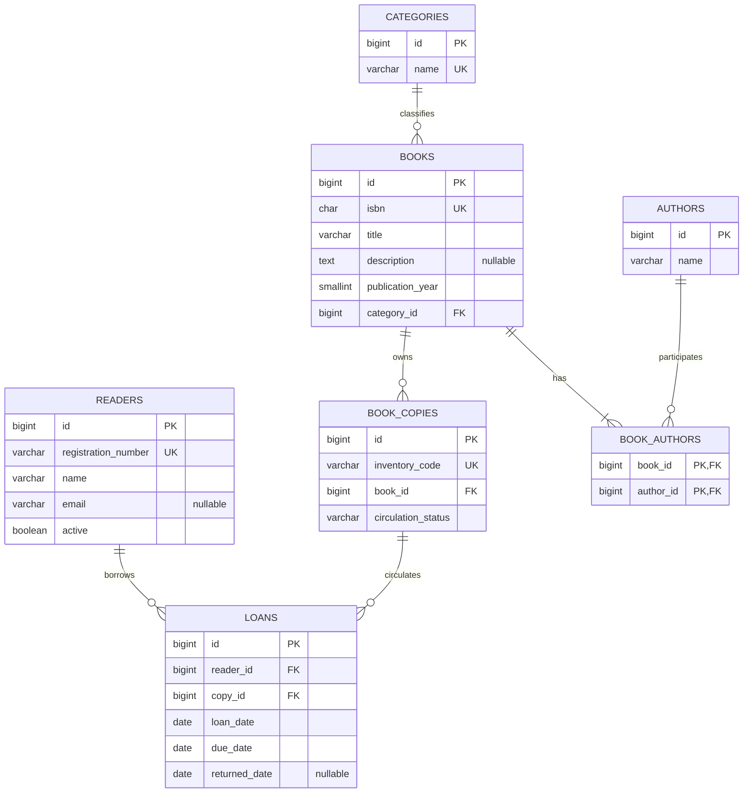

# Etapa 4 — Modelagem inicial do banco

Modelo proposto para MySQL 8.4/InnoDB, derivado do [escopo](../requirements/mvp-scope.md) e dos [casos de uso](../requirements/use-cases.md). Ainda não existe schema executado ou migration validada. A [análise de normalização](normalization.md) examina formalmente dependências funcionais antes de produzir DDL.

## Entidades e identificação

`Reader` representa o leitor; `Book`, uma edição bibliográfica; `BookCopy`, uma unidade física. `Loan` registra um empréstimo de um exemplar para um leitor. `Author` e `Category` descrevem o catálogo. `BookAuthor` resolve o relacionamento muitos-para-muitos.

Usaremos nomes em inglês e `snake_case` no banco. PKs técnicas `BIGINT` positivas, geradas por `AUTO_INCREMENT`, preservam referências mesmo se matrícula ou código patrimonial mudar. Java usará `Long`; não há necessidade de tipos unsigned. Identificadores comerciais terão UNIQUE e não substituirão PKs.

## Dicionário inicial

Todos os campos são NOT NULL, exceto os explicitamente opcionais. Comprimentos abaixo são limites propostos para contratos e schema, não medidas do mundo real.

| Tabela | Coluna | Tipo proposto | Regra |
| --- | --- | --- | --- |
| readers | id | BIGINT | PK, auto increment |
| readers | registration_number | VARCHAR(30) | UNIQUE, obrigatório |
| readers | name | VARCHAR(150) | Não vazio |
| readers | email | VARCHAR(254) | Opcional, não único |
| readers | active | BOOLEAN | Default true |
| authors | id | BIGINT | PK, auto increment |
| authors | name | VARCHAR(150) | Não vazio; homônimos permitidos |
| categories | id | BIGINT | PK, auto increment |
| categories | name | VARCHAR(100) | UNIQUE, não vazio |
| books | id | BIGINT | PK, auto increment |
| books | isbn | CHAR(13) | UNIQUE; ISBN-13 canônico válido |
| books | title | VARCHAR(250) | Não vazio |
| books | description | TEXT | Opcional; limite da API proposto de 5000 caracteres |
| books | publication_year | SMALLINT | Entre 1 e 9999 |
| books | category_id | BIGINT | FK categories.id |
| book_authors | book_id | BIGINT | PK composta, FK books.id |
| book_authors | author_id | BIGINT | PK composta, FK authors.id |
| book_copies | id | BIGINT | PK, auto increment |
| book_copies | inventory_code | VARCHAR(40) | UNIQUE, obrigatório |
| book_copies | book_id | BIGINT | FK books.id; imutável pela aplicação |
| book_copies | circulation_status | VARCHAR(20) | IN_CIRCULATION ou WITHDRAWN; default IN_CIRCULATION |
| loans | id | BIGINT | PK, auto increment |
| loans | reader_id | BIGINT | FK readers.id |
| loans | copy_id | BIGINT | FK book_copies.id |
| loans | loan_date | DATE | Data do empréstimo |
| loans | due_date | DATE | Estritamente posterior a loan_date |
| loans | returned_date | DATE | Opcional; quando presente, >= loan_date |

BOOLEAN é alias numérico no MySQL; CHECK limitará `active` a 0 ou 1. ISBN terá validação de tamanho, dígitos e dígito verificador no servidor. O banco garantirá unicidade do valor canônico. Não inventaremos restrição de ano anterior ao ano atual: edições futuras podem ser catalogadas.

## Texto e normalização de identificadores

Base `utf8mb4`, com collation proposta `utf8mb4_0900_ai_ci` para nomes e títulos: comparação sem distinção de caixa e acentos. Assim, categorias `Ficção` e `ficcao` conflitam; essa é uma decisão explícita, revisável antes da migration. Autores continuam não únicos.

Matrícula e código patrimonial aceitam inicialmente letras ASCII, números, ponto, hífen e sublinhado, removem espaços nas extremidades e convertem letras para maiúsculas antes de persistir. Comparação dessas colunas usa collation binária; a regra canônica determina equivalência. ISBN armazena somente 13 dígitos ASCII. Regras de formato também serão verificadas no servidor; constraints de formato no banco serão avaliadas no DDL, sem presumir que somente uma API fará escrita.

Nomes e título são aparados e não podem ficar vazios; não alterar caixa de nomes próprios. E-mail vazio vira NULL; não há requisito de confirmação ou envio. Esses limites são propostas técnicas adicionais, a serem incorporadas à validação, sem excluir arbitrariamente nomes Unicode.

## Relacionamentos e participação

| Relacionamento | Cardinalidade | Participação |
| --- | --- | --- |
| Category → Book | 1:N | Livro tem exatamente uma categoria; categoria pode não ter livros |
| Book ↔ Author | N:M via BookAuthor | Livro tem ao menos um autor; autor pode não ter livros |
| Book → BookCopy | 1:N | Exemplar tem um livro; livro pode não ter exemplares |
| Reader → Loan | 1:N | Empréstimo tem um leitor; leitor pode não ter histórico |
| BookCopy → Loan | 1:N ao longo do tempo | Empréstimo tem um exemplar; exemplar pode não ter histórico |

Um empréstimo não guarda `book_id`: o livro é obtido por `copy_id → book_id`. Não criamos entidade de quantidade, status de atraso, multa ou reserva. O banco não precisa de especialização/generalização ou agregação neste escopo.

O mínimo de um autor aparece no modelo conceitual; uma FK não garante sozinha a existência de ao menos uma linha filha. Criação/edição do livro e seus vínculos serão atômicas e validarão esse mínimo. O diagrama documenta a proposta; não foi renderizado por ferramenta nesta etapa.

## Mapeamento para o modelo relacional

Cada entidade forte vira tabela com PK própria. Relações 1:N recebem FK no lado N; N:M recebe tabela associativa com PK `(book_id, author_id)`, impedindo associação duplicada. Dados opcionais usam NULL, não strings vazias ou datas fictícias.

Todas as FKs terão `ON DELETE RESTRICT` e `ON UPDATE RESTRICT` inicialmente. Exclusão de livro sem exemplares removerá explicitamente seus vínculos BookAuthor e o livro na mesma transação; nunca apagará autores. Leitor, exemplar ou livro com dependências não serão eliminados por cascata. PKs não são editáveis.

O histórico preserva vínculos e datas, mas nomes e títulos consultados refletem o cadastro atual. Não estamos implementando auditoria de todas as versões dos metadados. ISBN com histórico não muda, e o livro de um exemplar é imutável pela aplicação; corrigir dados bibliográficos não altera a identidade técnica do empréstimo.

## Integridade: o que fica no banco e no serviço

| Regra | Banco | Serviço transacional |
| --- | --- | --- |
| Referências existentes | FKs obrigatórias | Mensagens e validação de recursos |
| Matrícula, ISBN e patrimônio únicos | UNIQUE | Normalização e tratamento de conflito |
| Datas consistentes | CHECK das datas | Data atual/fuso e cálculo do prazo |
| Circulação e boolean válidos | CHECK dos valores | Transições permitidas |
| Um empréstimo ativo por exemplar | UNIQUE condicional via coluna gerada, a validar | Bloqueio e revalidação da disponibilidade |
| Leitor ativo para emprestar | Não expressável por CHECK simples entre tabelas | Bloquear leitor e verificar active |
| Exemplar em circulação para emprestar | Não expressável por CHECK simples entre tabelas | Bloquear exemplar e verificar estado |
| Livro com ao menos um autor | FK isolada insuficiente | Salvar livro e vínculos atomicamente |
| ISBN não muda com histórico | FK/UNIQUE não bastam | Consultar histórico sob proteção concorrente |
| Devolução ocorre uma vez | CHECK não assegura transição | Revalidar empréstimo bloqueado e atualizar uma vez |

Não usaremos triggers para duplicar todas as regras. Escrita direta no banco deve ser restrita a administração/migrations e testes: nem toda regra de negócio é garantida por constraints. Isso será explicitado nas permissões e documentação futuras.

### Exclusividade do empréstimo ativo

MySQL não oferece índice parcial no formato `WHERE returned_date IS NULL`. A proposta é uma coluna técnica gerada `active_copy_id BIGINT`, com expressão equivalente a `CASE WHEN returned_date IS NULL THEN copy_id ELSE NULL END`, e UNIQUE nessa coluna. Empréstimos ativos produzem o id do exemplar; devolvidos produzem NULL, para o qual o MySQL permite múltiplas entradas em índice único.

Essa coluna não é um atributo independente do domínio nem um contador mantido manualmente. Sintaxe, suporte e compatibilidade JPA/Flyway serão verificados no MySQL real na etapa de implementação. A migration não será considerada validada só por estar escrita.

### Transações e concorrência

UC05 bloqueia leitor antes de verificar status e bloqueia exemplar antes de verificar circulação e empréstimo ativo. UC01 usa o mesmo bloqueio do leitor ao alterar status. UC04 usa o mesmo bloqueio do exemplar ao retirar de circulação. Assim, condições são serializadas entre operações conflitantes.

Para evitar inversão com edição de ISBN, a ordem global proposta para operações que precisem de múltiplos recursos é: leitor → livro → exemplar → empréstimo; dentro do mesmo tipo, id crescente. Edição de ISBN bloqueia livro antes de verificar histórico; novos empréstimos do livro também bloqueiam esse livro. Devolução descobre os ids associados, bloqueia livro/exemplar e então empréstimo, revalidando tudo antes de atualizar. Essas leituras e verificações exigirão atenção ao isolamento InnoDB: usar leituras atuais apropriadas, sem depender de um snapshot antigo.

O índice único é a última defesa para empréstimo ativo duplicado; não substitui validação do leitor e exemplar. A ordem de bloqueios é uma proposta a testar, não promessa de ausência absoluta de deadlocks. Rollback e tratamento de conflito devem preservar o estado; não repetir operações sem avaliar se o commit aconteceu.

## Disponibilidade, atraso e datas

Disponível: `circulation_status = IN_CIRCULATION` e ausência de Loan com `returned_date IS NULL`. Quantidade total por livro é contagem de exemplares; quantidade disponível é contagem desse subconjunto. Exemplares retirados contam como registrados, mas não disponíveis; rótulos no dashboard devem deixar isso claro.

Ativo: devolução ausente. Atrasado: ativo e vencimento anterior à data atual da biblioteca. Devolvido: devolução presente. Não há coluna `loan_status`, evitando combinações como status devolvido com data ausente.

`due_date` é armazenada porque registra o prazo contratado no momento do empréstimo; mudar a configuração não altera empréstimos anteriores. A data de referência dos relatórios vem do relógio da aplicação no fuso configurado. Não depender implicitamente de `CURRENT_DATE` de uma conexão com outro fuso.

## Índices candidatos

Além de PKs e UNIQUEs: `books(category_id)`, `book_authors(author_id, book_id)`, `book_copies(book_id)`, `loans(reader_id, loan_date, id)`, `loans(copy_id)` e `loans(returned_date, due_date)`. Índice para atividade recente em `(loan_date, id)` será avaliado. Evitar duplicar índices que o InnoDB já precisa criar para FKs; registrar definições explícitas úteis.

Não afirmar que índice B-tree resolve busca por substring de título/autor. Começar com volume acadêmico, paginação e consultas claras; medir planos com EXPLAIN antes de adotar busca FULLTEXT ou mais índices.

## Cenário de verificação futuro

Criar uma categoria, dois autores, um livro, dois exemplares e um leitor. Verificar que a associação de autores não duplica contagens do dashboard. Emprestar um exemplar: dois exemplares registrados, um disponível, um empréstimo ativo. Devolver: dois disponíveis e um registro histórico. Retirar o outro exemplar: um disponível. Exclusões que afetem esse histórico devem falhar. Executar tentativas concorrentes sobre exemplar e leitor, além de rollback no cadastro de livro com vínculo inválido.

Esse cenário ainda não foi executado. AC02–AC13 e AC17 serão ligados às constraints e aos testes reais quando houver schema.

## O que entender e defender

Uma PK identifica tecnicamente; uma chave candidata expressa unicidade do negócio; uma FK vincula tabelas, mas não resolve automaticamente todas as regras. A tabela associativa transforma N:M em duas relações 1:N. Atributos derivados evitam inconsistência, enquanto dados históricos como vencimento precisam permanecer armazenados.

Em Banco de Dados: entidades, atributos, chaves, participação, cardinalidades, integridade declarativa e mapeamento MER → relacional. Em Análise e Projeto: separar identificação bibliográfica de circulação e localizar responsabilidades que precisam de uma transação.

Perguntas de professores: por que não armazenar autores em uma coluna? Porque são uma relação N:M consultável com integridade. Por que não guardar apenas quantidade? Porque empréstimos pertencem a unidades físicas. Como garantir apenas um empréstimo ativo? Índice condicional em coluna gerada mais coordenação transacional, verificados no MySQL. Histórico significa auditoria completa? Não: preservamos empréstimos e vínculos; versões dos metadados ficam fora do MVP.

Continuação: [dependências funcionais e normalização](normalization.md), com revisão do modelo antes do DDL.
