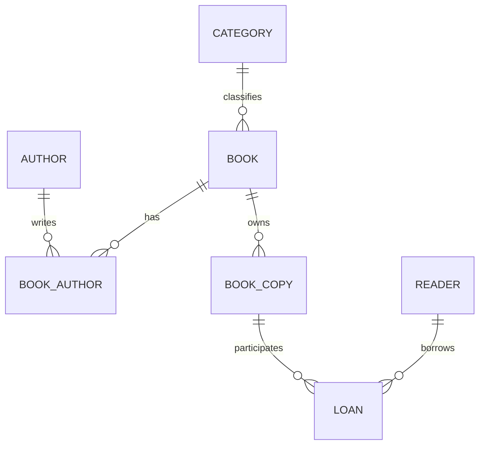
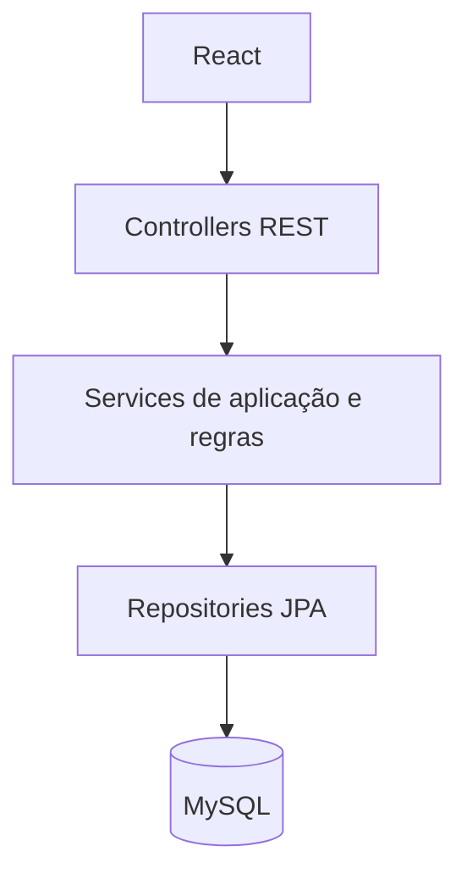

# Análise inicial da proposta

## 1. Avaliação

O domínio é adequado às duas disciplinas: possui relacionamentos muitos-para-muitos, histórico, restrições de integridade e operações que exigem transações. Também oferece oportunidades concretas de separar responsabilidades e comparar manutenção antes e depois de refatorações. O principal risco é tentar entregar todas as tecnologias e padrões da ementa ao mesmo tempo. A prioridade será um fluxo completo: cadastrar leitor e livro, emprestar e devolver.

Esta análise é uma proposta para revisão. Não representa funcionalidades implementadas ou resultados medidos.

## 2. Escopo recomendado

Uma biblioteca, operada por um bibliotecário, com catálogo, leitores e circulação de livros. O MVP não terá múltiplas filiais, reservas, multas, notificações externas ou autoatendimento. Leitor cadastrado é uma entidade do domínio, não necessariamente uma conta de acesso.

Recomendamos controlar exemplares físicos individualmente. ISBN identifica uma edição; um identificador patrimonial identifica cada exemplar. Isso permite bloquear empréstimos duplicados do mesmo objeto e preservar seu histórico. Quantidade e disponibilidade serão calculadas a partir dos exemplares, sem manter contadores redundantes no livro.

## 3. Funcionalidades obrigatórias e opcionais

Obrigatórias: cadastro e consulta de leitores, autores, categorias, livros e exemplares; edição e exclusão quando permitidas; ativação/desativação de leitores; empréstimo e devolução; histórico; busca e paginação; dashboard de circulação; validação e erros claros; migrations MySQL; testes das regras críticas; documentação de modelagem e evolução.

Opcionais, após o MVP: renovação, reservas, autenticação de bibliotecários, exportação de relatórios e notificações. Autenticação passa a ser obrigatória antes de disponibilizar operações de escrita em uma demonstração pública. Multas dependem de regras institucionais e não serão presumidas.

## 4. Requisitos funcionais

| ID | Comportamento esperado |
| --- | --- |
| RF01 | Cadastrar, listar, consultar e editar leitores; controlar status ativo. |
| RF02 | Consultar histórico de empréstimos por leitor. |
| RF03 | Gerenciar autores e categorias, respeitando vínculos existentes. |
| RF04 | Gerenciar livros com ISBN, título, descrição opcional, ano, categoria e autores. |
| RF05 | Gerenciar exemplares com identificação patrimonial e status de circulação. |
| RF06 | Registrar empréstimo de um exemplar a um leitor válido e ativo. |
| RF07 | Registrar devolução uma única vez e liberar o exemplar. |
| RF08 | Listar empréstimos ativos, devolvidos e atrasados. |
| RF09 | Buscar catálogo por título, ISBN, autor e categoria; paginar listas. |
| RF10 | Exibir totais de títulos, exemplares e leitores, disponibilidade, empréstimos ativos/atrasados, títulos mais emprestados e empréstimos recentes. |
| RF11 | Informar falhas de validação, conflito e recurso inexistente sem expor detalhes internos. |

## 5. Requisitos não funcionais

- RNF01: persistência obrigatória em MySQL; schema versionado por migrations.
- RNF02: empréstimo e devolução atômicos; concorrência não pode gerar dois empréstimos ativos do mesmo exemplar.
- RNF03: interface utilizável a partir de 320px, com teclado, foco visível, labels e redução de movimento.
- RNF04: nenhuma credencial versionada; configuração por variáveis; logs sem dados sensíveis desnecessários.
- RNF05: API com validação no servidor, consultas parametrizadas, erros consistentes e CORS restrito à origem configurada.
- RNF06: comandos de instalação e testes reproduzíveis e documentação coerente com o código.
- RNF07: listas paginadas e índices orientados às consultas reais; metas numéricas de desempenho serão definidas após medir volume e ambiente.
- RNF08: módulos com responsabilidades identificáveis e testes verificáveis. Não fixaremos uma cobertura artificial.

## 6. Regras de negócio

| ID | Regra |
| --- | --- |
| RN01 | Somente leitores ativos podem iniciar empréstimos. Desativação preserva histórico e permite devoluções pendentes. |
| RN02 | Somente exemplares habilitados, sem empréstimo ativo, podem ser emprestados. |
| RN03 | Um exemplar tem no máximo um empréstimo ativo, inclusive sob requisições concorrentes. |
| RN04 | Um empréstimo referencia leitor e exemplar existentes. |
| RN05 | A data prevista é posterior à data do empréstimo; a devolução não precede o empréstimo. |
| RN06 | Não é permitido devolver duas vezes; a segunda tentativa informa conflito. |
| RN07 | Empréstimo está atrasado quando não devolvido e a data prevista é anterior à data atual da biblioteca. |
| RN08 | ISBN normalizado, matrícula do leitor e identificação patrimonial são únicos. E-mail, quando informado, terá regra de unicidade definida explicitamente. |
| RN09 | Registros com histórico não são removidos fisicamente. Exclusões sem histórico respeitam todas as FKs; exemplares podem ser retirados de circulação. |
| RN10 | Autor ou categoria com livros associados não pode ser excluído sem tratar os vínculos. |
| RN11 | Livro deve ter ao menos um autor; categoria é obrigatória no escopo inicial. |
| RN12 | Disponibilidade e quantidades são derivadas; nunca podem indicar quantidade negativa. |

Proposta inicial: prazo de 14 dias corridos, configurável, sem multa nem limite arbitrário de empréstimos. O fuso da biblioteca será configurável; usamos datas de calendário para prazo, com relógio controlável nos testes. Emprestar outro exemplar da mesma edição ao mesmo leitor será inicialmente permitido; a restrição obrigatória é sobre o exemplar físico.

## 7. Entidades candidatas e relacionamentos

| Entidade | Atributos principais e chaves |
| --- | --- |
| Reader | id (PK), registrationNumber (UK), name, email opcional, active |
| Author | id (PK), name; nomes não são necessariamente únicos |
| Category | id (PK), name (UK) |
| Book | id (PK), isbn (UK), title, description, publicationYear, categoryId (FK) |
| BookAuthor | bookId + authorId (PK composta e FKs) |
| BookCopy | id (PK), inventoryCode (UK), bookId (FK), circulationStatus |
| Loan | id (PK), readerId (FK), copyId (FK), loanDate, dueDate, returnedDate opcional |

`Reader` evita confundir leitor com uma futura conta autenticada. Se for mantido o nome `User`, essa distinção deverá continuar explícita.

Cardinalidades: Category 1:N Book; Book N:M Author, mapeado por BookAuthor; Book 1:N BookCopy; Reader 1:N Loan; BookCopy 1:N Loan ao longo do tempo. Um leitor pode não ter empréstimos; um livro pode ser cadastrado antes de receber exemplares.

O diagrama representa o modelo proposto, não um schema já criado. A exigência de ao menos um autor será validada na operação transacional, pois FKs isoladas não expressam esse mínimo.

## 8. Dependências funcionais, normalização e SQL

Em cada entidade, a PK determina os demais atributos; ISBN, matrícula e código patrimonial também são chaves candidatas de suas entidades. BookAuthor não terá atributos que dependam de apenas parte da chave composta. Dados de categoria e autor não serão repetidos em Book ou Loan. Loan referencia o exemplar, cujo livro é obtido por relacionamento.

A meta é 3FN: atributos atômicos, ausência de dependências parciais e de dependências transitivas entre atributos não-chave. Essa justificativa deverá ser revisada no dicionário de dados final. Não armazenaremos `availableQuantity`, `overdue` ou nomes de autor em strings concatenadas.

DDL deve incluir PKs, FKs, UNIQUEs, NOT NULL e CHECKs compatíveis com MySQL 8.4. Índices devem atender busca e circulação. A garantia de empréstimo ativo único poderá usar índice único sobre coluna gerada condicional, além de transação e bloqueio da linha do exemplar; a sintaxe será validada no MySQL real antes de ser adotada.

Flyway será a fonte única das migrations, preferencialmente em `backend/src/main/resources/db/migration`. `database/` abrigará documentação e consultas didáticas, sem duplicar migrations. Hibernate validará o schema, sem criá-lo automaticamente.

JOINs e agregações atenderão histórico e dashboard. Uma view pode organizar relatórios reutilizáveis se houver benefício demonstrado. Trigger e stored procedure não serão usadas para duplicar regras do serviço. Exemplos acadêmicos separados poderão demonstrar esses recursos quando exigidos, com justificativa e sem criar duas fontes da mesma regra. ALTER será demonstrado por uma migration evolutiva; DROP apenas em evolução justificada ou exercícios isolados.

## 9. Casos de uso e riscos de escopo

Ator inicial: bibliotecário. Casos centrais: manter catálogo, manter leitores, emprestar exemplar, devolver exemplar, consultar histórico e acompanhar circulação. O empréstimo valida leitor, exemplar e prazo; persiste uma única operação; informa conflitos. A devolução localiza empréstimo ativo e registra a data efetiva. Diagramas de sequência serão produzidos quando essas interações tiverem implementação correspondente.

Riscos: autenticação antecipada, multas sem política, excesso de padrões, deploy antes de integração, frontend antes de estabilizar contratos, comparação de versões com funcionalidades diferentes e concorrência ignorada. Mitigação: entregas verticais pequenas, critérios de aceite, mesma base funcional na comparação e registro de decisões.

## 10. Arquitetura recomendada

Monólito com organização por domínio e camadas internas. Um único backend e um único banco são suficientes para o tamanho e a equipe do projeto. Microsserviços acrescentariam comunicação distribuída, operação e consistência eventual sem demanda demonstrada.

Controllers traduzem HTTP; services coordenam regras e transações; repositories persistem. DTOs definem contratos sem expor entidades diretamente. Pacotes propostos: `catalog`, `readers`, `loans` e infraestrutura pequena. Não criaremos interfaces para todo serviço sem necessidade de substituição.

## 11. Stack e justificativas

| Tecnologia proposta | Motivo e alternativa |
| --- | --- |
| Java 21 LTS | Base estável, compatível com o objetivo acadêmico; evita adotar versões apenas por novidade. |
| Spring Boot | Configuração e integração de aplicação web; versão suportada compatível com Java 21 será fixada ao iniciar a implementação. |
| Spring Web | API REST e tratamento HTTP. |
| Spring Data JPA / Hibernate | Persistência e transações; SQL explícito continua importante em migrations e consultas específicas. |
| Bean Validation | Validação declarativa dos contratos; não substitui regras de negócio ou constraints. |
| Maven | Build e dependências reproduzíveis, com wrapper na implementação. |
| MySQL 8.4 LTS | Atende exigência da disciplina; testes reais evitam diferenças escondidas por H2. |
| Flyway | Evolução versionada e verificável do schema. |
| JUnit, Mockito, Spring Boot Test | Testes de regras, dependências e integração; mocks somente onde úteis. |
| React + TypeScript + Vite | Componentes, contratos tipados e ambiente de desenvolvimento simples. |
| React Router | Navegação entre catálogo, leitores e empréstimos quando as telas existirem. |

Spring Security não é necessário para validar a primeira versão local de circulação. Será avaliado antes de acesso compartilhado e exigido para escrita pública. Não usaremos JWT automaticamente: sessão com cookie seguro pode ser mais simples para uma aplicação de um único backend.

CSS comum com tokens da paleta dark proposta é suficiente inicialmente. Tailwind é opcional e deverá justificar seu ganho. Animações discretas podem ser feitas com CSS e `prefers-reduced-motion`; Motion só se houver interações que o justifiquem. Bibliotecas de componentes acessíveis serão consideradas para modais complexos, sem substituir compreensão de foco e semântica.

## 12. Estratégia de testes e TDD

Começar por regras: leitor inativo, exemplar indisponível, datas inválidas, devolução duplicada e manutenção de histórico. JUnit testa comportamentos; Mockito isola dependências apropriadas; Clock permite controlar a data.

Testes de integração MySQL verificarão migrations, constraints, consultas e transações. Testcontainers é adequado quando Docker estiver disponível; caso contrário, usar banco MySQL de testes isolado. Testes de controller verificam validação e códigos HTTP. Um teste concorrente deve demonstrar que apenas um empréstimo de um exemplar é aceito.

Fluxo ponta a ponta: cadastrar autor/categoria/livro/exemplar/leitor, emprestar, verificar indisponibilidade, devolver e verificar liberação e histórico. Testes do frontend focarão submissão, erros e navegação relevante.

TDD será documentado em funcionalidades novas, com evidência real de RED, GREEN e REFACTOR. Não chamaremos de TDD um teste escrito depois. Cobertura e complexidade só serão reportadas com ferramenta, comando e revisão exata; nenhum número é conhecido nesta etapa.

## 13. Evolução da versão inicial para a refatorada

1. Fixar requisitos e modelagem revisados.
2. Construir versão inicial funcional com problemas controlados de coesão, duplicação e dependências concretas. Mesmo essa versão deve proteger dados, credenciais e integridade; não introduzir falhas de segurança deliberadas.
3. Preservar a versão por commit e tag local, como `v0.1-baseline`, somente quando validada.
4. Executar testes de caracterização e coletar métricas comparáveis antes das alterações.
5. Documentar problemas reais, sem inventar defeitos para justificar padrões.
6. Refatorar por responsabilidade e manter os mesmos comportamentos observáveis.
7. Reexecutar testes, medir pelos mesmos comandos e registrar benefícios e custos.

Para cada problema: arquivo/classe, evidência, princípio, consequência, gravidade, solução, justificativa, alteração, benefício observado e impacto nos testes. Os estados antes/depois devem ser recuperáveis no Git. Métricas podem incluir tamanho, complexidade e duplicação; coesão e acoplamento qualitativos devem ser identificados como análise, não números objetivos.

## 14. Conceitos demonstráveis e limites

SOLID: SRP ao separar contratos, regras e persistência; DIP em dependências externas que precisem substituição; OCP e Strategy apenas se surgirem políticas reais alternativas. LSP e ISP são aplicáveis se houver hierarquias e contratos relevantes, sem criá-los artificialmente.

GRASP: Controller na entrada da operação; Information Expert nas decisões com os dados necessários; High Cohesion e Low Coupling na separação de módulos; Pure Fabrication em serviços de persistência ou integração. Creator, Indirection e Protected Variations serão discutidos onde houver evidência no código.

Padrões: Strategy pode servir a políticas de prazo se houver mais de uma; Observer pode atender notificações futuras; Facade pode simplificar uma operação composta. State só com transições suficientemente complexas. Não forçar Abstract Factory, Composite ou Visitor em CRUD simples. Não implementar Singleton global manual: o ciclo de vida de beans Spring é outra decisão, não justificativa automática para estado global.

UML: casos de uso para delimitar atores; classes para relações implementadas; sequência para empréstimo/devolução; comunicação somente se acrescentar uma leitura útil. Mermaid atende boa parte da documentação; PlantUML pode ser usado para casos de uso quando a notação exigir. Diagramas propostos devem ser diferenciados dos implementados.

## 15. Frontend e acessibilidade

Tema dark com fundo `#10002B`, superfícies `#240046`, destaque `#9D4EDD` e texto claro; contraste será medido antes de afirmar conformidade. Layout com navegação consistente, cabeçalhos, formulários e tabelas com scroll horizontal em telas pequenas quando necessário. Não esconder ações essenciais em mobile.

Usar labels associados, erros vinculados aos campos, foco visível, indicadores textuais e submissão bloqueada enquanto pendente. Estados de loading, vazio, falha e sucesso devem refletir o servidor. Componentes compartilhados pequenos para botões, campos e feedback. Evitar componente genérico que concentre toda a interface. Mensagens e documentação em português; identificadores de código em inglês.

## 16. Docker e configuração

Docker Compose primeiro para MySQL; backend e frontend entram quando seus builds existirem. Fixar versões, criar volume persistente e healthcheck, não assumir que ordem de inicialização significa prontidão. Containers não substituem testes funcionais.

Planejar `.env.example` apenas com nomes e exemplos não secretos, `.env` ignorado e variáveis para URL do banco, usuário, senha e origem do frontend. Não inventar nem versionar senhas. A documentação distinguirá execução local, Compose e testes, incluindo limpeza de dados somente com aviso explícito.

## 17. Deploy

Opções a verificar na etapa de deploy, sem prometer planos gratuitos atuais:

| Alternativa | Vantagens | Limitações |
| --- | --- | --- |
| VPS pequena com Compose e TLS | Backend e MySQL juntos; controle e custo mensal previsível | Administração, atualizações, backups e monitoramento ficam com o responsável |
| Plataforma gerenciada para backend/MySQL | Operação simplificada | Preços, armazenamento, região, limites e eventual suspensão dependem do provedor |
| Hospedagem estática para React + backend separado | Frontend simples de distribuir | CORS, cookies e dois deployments exigem configuração cuidadosa |

Recomendação inicial para apresentação: execução local por Compose e dados demonstrativos, com plano alternativo offline. Uma demonstração pública pequena pode usar uma VPS com frontend servido na mesma origem, backend e MySQL privado, caso orçamento e capacidade operacional permitam. Preços e políticas de provedores serão consultados na ocasião; não foram verificados nesta análise. Serviços que dormem podem prejudicar uma apresentação. Publicação exige autenticação, HTTPS, backups e dados fictícios.

## 18. Estrutura inicial e Git

Agora: README, este documento e `.gitignore`. Criar diretórios apenas quando houver arquivos úteis. Futuro: `backend/`, `frontend/`, `database/` para material SQL, e `docs/` organizado por documentação realmente existente. Migrations terão uma única fonte no backend. LICENSE depende de escolha do autor; não será presumida.

`main` é a linha principal. Branches curtas por entrega e commits significativos facilitam revisão. Nenhum histórico artificial será produzido para simular TDD ou evolução.

## 19. Atendimento às disciplinas

Banco de Dados: MER, cardinalidades, chaves, mapeamento relacional, dependências funcionais, 3FN, dicionário, SQL, índices, integridade e transações serão aplicados à circulação real. Especialização e agregação só entram se houver necessidade do domínio; não são obrigatórias para esta modelagem.

Análise e Projeto: requisitos, casos de uso, camadas, coesão/acoplamento, responsabilidades, UML, testes e refatoração com comparação verificável. Microsserviços, filas e todos os padrões da ementa não são necessários para demonstrar compreensão: justificar a ausência também é parte da análise.

## 20. Plano de desenvolvimento e critérios de avanço

Seguir as etapas solicitadas: requisitos → escopo → casos de uso → modelagem → normalização → arquitetura → estrutura → baseline funcional → análise → refatoração → testes/TDD demonstrativos → consolidação REST → frontend → integração → Docker → documentação → deploy → revisão acadêmica.

Testes de integridade e validação mínima acompanharão o baseline; a etapa posterior aprofunda a suíte e demonstra TDD em novas regras. A API mínima existirá para executar o backend antes da consolidação REST, sem fingir que interfaces só surgem após todos os testes.

**Esta entrega encerra a análise inicial. A implementação aguarda confirmação do autor, conforme o prompt.**

Antes de avançar, entender: título versus exemplar; leitor versus conta de acesso; cardinalidade versus regra transacional; 3FN e redundância; responsabilidade de cada camada; diferença entre refatorar e mudar comportamento.

Perguntas que professores podem fazer: por que modelar exemplares? Como garantir exclusividade sob concorrência? Por que MySQL e não H2 nos testes de integração? Por que não microsserviços? Como provar que a refatoração preservou comportamento? Qual padrão resolveu um problema real? As respostas serão sustentadas por schema, testes, commits e decisões, conforme forem implementados.
