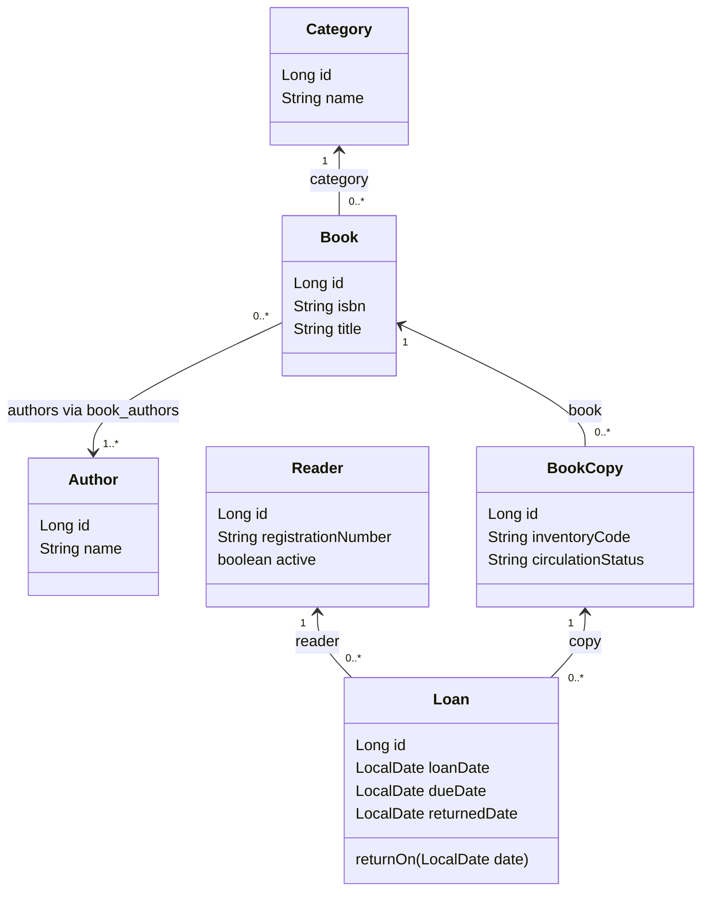
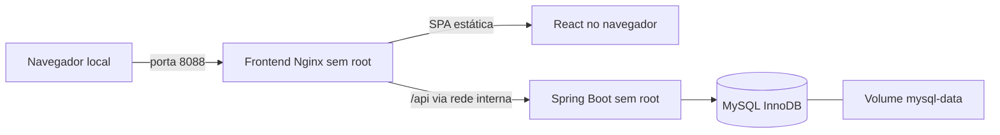

# Diagramas da implementação — etapa 16

Representação abreviada do código e das migrations atuais; atributos secundários e métodos de acesso foram omitidos. Os blocos Mermaid são fontes para renderização pelo leitor Markdown; não foi executado um renderizador Mermaid externo nesta tarefa.

## Entidades e relações



BookAuthor é associação física book_authors, não uma classe JPA própria. Os sentidos das setas representam referências efetivas das entidades, sem presumir coleções reversas. ISBN identifica edição; patrimônio identifica exemplar. returnedDate null identifica não devolvido; status de atraso não é coluna de Loan. A coluna gerada active_copy_id existe no SQL para unicidade condicional, sem ser um atributo editável do DTO.

## Empréstimo no fluxo aceito

```mermaid
sequenceDiagram
    actor Librarian as Bibliotecário
    participant UI as LoansPage
    participant Controller as LoanController
    participant Service as LoanService
    participant DB as Repositories e MySQL
    Librarian->>UI: Seleciona leitor ativo e exemplar
    UI->>Controller: POST /api/loans (readerId, copyId)
    Controller->>Service: create(LoanRequest)
    Note over Service,DB: Transação READ_COMMITTED
    Service->>DB: locked(readerId); valida active
    Service->>DB: bookId(copyId); locked(bookId)
    Service->>DB: locked(copyId); verifica circulação/ocupação
    Service->>Service: Hoje pelo Clock; vencimento configurado
    Service->>DB: saveAndFlush(Loan)
    Note over DB: UNIQUE active_copy_id e CHECK de datas
    DB-->>Service: Empréstimo persistido
    Service-->>Controller: LoanResponse; transação concluída
    Controller-->>UI: 201 + Location + JSON
    UI-->>Librarian: Confirma sucesso e atualiza referências/histórico
```

Erros de recurso, entrada ou negócio são traduzidos por ApiExceptionHandler para 404/400/409; constraints conhecidas também viram conflito. Falha desconhecida não é classificada automaticamente como duplicidade. Uma perda de conexão pode deixar confirmação incerta, por isso a interface não repete POST automaticamente.

## Devolução no fluxo aceito

```mermaid
sequenceDiagram
    actor Librarian as Bibliotecário
    participant UI as LoansPage
    participant Service as LoanService via LoanController
    participant DB as Repositories e MySQL
    Librarian->>UI: Confirma devolução
    UI->>Service: POST /api/loans/{id}/return
    Note over Service,DB: Transação READ_COMMITTED
    Service->>DB: copyId(loanId); bookId(copyId)
    Service->>DB: locked(bookId); locked(copyId); locked(loanId)
    Service->>Service: Valida ainda não devolvido e data >= loanDate
    Service->>DB: returnOn(hoje); flush
    Service-->>UI: 200 LoanResponse RETURNED após transação
    UI-->>Librarian: Confirma e atualiza histórico/disponibilidade
```

Não há bloqueio/validação de leitor ativo nessa operação: leitor inativo pode devolver. A disponibilidade é derivada da ausência de empréstimo não devolvido e do estado do exemplar, sem contador armazenado no livro.

## Execução Compose



Backend e banco não publicam portas no host. Os agrupamentos de código mantêm dependências entre domínios, inclusive catálogo/leitores consultando histórico de loans; o desenho de containers não prova desacoplamento interno. Veja [execução](../../docker/README.md).
